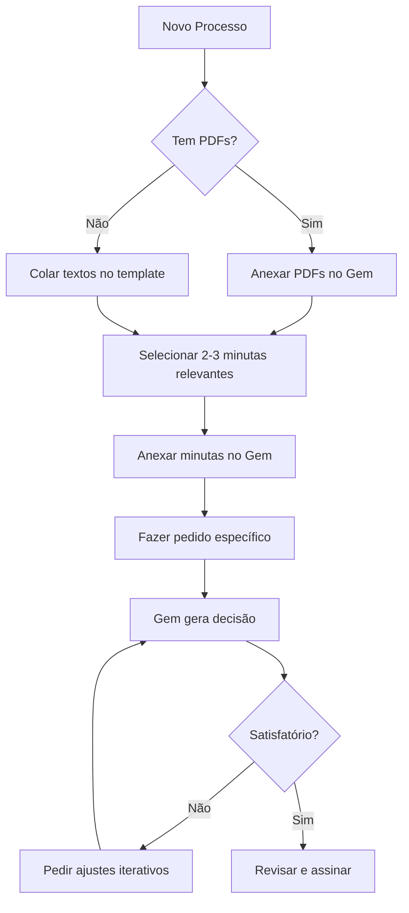

# 🤖 Gem para Gemini - Assessor Jurídico Criminal

Este repositório agora está adaptado para ser usado como um **Gem (assistente personalizado)** no **Google Gemini 3.0 Pro**.

## 📂 Arquivos Criados para o Gem

### 1. **GEM_INSTRUCOES_OTIMIZADO_GEMINI_3_PRO.md** ⭐ PRINCIPAL
**O que é**: Instruções completas otimizadas para o Gemini 3.0 Pro
**Como usar**: Cole este arquivo COMPLETO no campo de instruções ao criar seu Gem
**Características**:
- ✅ Otimizado para janela de contexto de 2M tokens
- ✅ Aproveita capacidades multimodais (PDFs, imagens)
- ✅ Instruções detalhadas de formatação e estilo
- ✅ Regras jurídico-processuais específicas
- ✅ Anti-injection de prompts
- ✅ Checklist de qualidade integrado

### 2. **GEM_INSTRUCOES_GEMINI.md**
**O que é**: Versão simplificada das instruções
**Como usar**: Alternativa mais curta se a versão otimizada for muito longa
**Quando usar**: Se o Gemini reclamar de instruções muito longas (improvável no 3.0 Pro)

### 3. **GEM_GUIA_USO_GEMINI.md**
**O que é**: Guia completo de como usar o Gem
**Para quem**: Usuário que vai criar e usar o Gem
**Conteúdo**:
- Passo a passo para criar o Gem
- Como estruturar consultas
- Dicas de uso
- Solução de problemas
- Limitações e capacidades

### 4. **GEM_CONTEXTO_BASE.md**
**O que é**: Template para estruturar consultas
**Como usar**: Copie e cole, preenchendo com dados do seu caso
**Benefício**: Garante que você forneça todas as informações necessárias

## 🚀 Início Rápido (3 Passos)

### Passo 1: Criar o Gem
1. Acesse [gemini.google.com](https://gemini.google.com)
2. Clique em **"Gems"** (menu lateral)
3. Clique em **"Criar novo Gem"**
4. Nome: **"Assessor Jurídico Criminal"**
5. **Cole todo o conteúdo** do arquivo `GEM_INSTRUCOES_OTIMIZADO_GEMINI_3_PRO.md`
6. Salve

### Passo 2: Preparar seu Caso
1. Abra o arquivo `GEM_CONTEXTO_BASE.md`
2. Copie o template
3. Preencha com os dados do seu processo:
   - Identificação (processo, partes, juiz)
   - Fase processual
   - Documentos (pode anexar PDFs diretamente)
   - Selecione 2-3 minutas relevantes do repositório
   - Adicione jurisprudência (se houver)

### Passo 3: Usar o Gem
1. Abra o Gem que você criou
2. **Opção A - Com template**:
   - Cole o contexto preenchido do Passo 2
   - Adicione: "Elaborar [tipo de decisão]"
3. **Opção B - Direta**:
   - Anexe PDFs do processo
   - Anexe 1-3 minutas de referência
   - Escreva: "Elaborar decisão de [tipo] baseado nos documentos anexos"

## 📋 Exemplo de Uso Completo

```
CASO: Processo 0012345-67.2025.8.17.0001

FASE: Resposta à Acusação apresentada, aguardando decisão sobre
absolvição sumária e designação de AIJ

PARTES:
- MP: Dr. João Silva
- Réu: José Santos (PRESO desde 1º/11/2024)
- Defesa: Defensoria Pública

DOCUMENTOS: [anexar PDFs ou colar textos]

MINUTAS DE REFERÊNCIA: [anexar 1-3 arquivos .md do repositório]

PEDIDO: Elaborar decisão após resposta à acusação, observando que
o réu está preso há mais de 90 dias (aplicar art. 316 CPP)
```

## 🎯 Vantagens do Gemini 3.0 Pro

### Grande Contexto
- Processa processos inteiros com centenas de páginas
- Mantém contexto de conversas muito longas
- Aceita múltiplas minutas de referência

### Multimodalidade
- **Anexe PDFs diretamente** - não precisa extrair texto manualmente
- Lê documentos escaneados (OCR automático)
- Identifica carimbos, selos, assinaturas em imagens

### Raciocínio Avançado
- Compreende nuances processuais complexas
- Mantém consistência argumentativa
- Identifica contradições e lacunas

### Iteração
- Faça ajustes iterativos: "Reduza o relatório", "Desenvolva mais a fundamentação"
- Não precisa reiniciar do zero

## 📁 Estrutura do Repositório

```
decisoes-vara-criminal/
├── README.md                                    # README original
├── README_GEM_GEMINI.md                        # Este arquivo
├── minutas_metadata.json                       # Catálogo de minutas
├── GEM_INSTRUCOES_OTIMIZADO_GEMINI_3_PRO.md   # ⭐ Instruções principais
├── GEM_INSTRUCOES_GEMINI.md                    # Instruções simplificadas
├── GEM_GUIA_USO_GEMINI.md                      # Guia do usuário
├── GEM_CONTEXTO_BASE.md                        # Template de consulta
├── [100+ arquivos .md]                         # Minutas de decisões
└── [outros arquivos do repositório original]
```

## 🔄 Fluxo de Trabalho Recomendado



## ⚙️ Configurações Recomendadas

Ao criar o Gem, configure:
- **Nome**: Assessor Jurídico Criminal
- **Descrição**: Especializado em decisões de vara criminal (exceto júri e LVDM)
- **Instruções**: Cole `GEM_INSTRUCOES_OTIMIZADO_GEMINI_3_PRO.md`
- **Temperatura**: 0.3-0.5 (respostas mais consistentes)

## 🛠️ Casos de Uso

### ✅ O Gem é ÓTIMO para:
- Recebimento de denúncia
- Análise de resposta à acusação
- Decisões interlocutórias
- Sentenças (absolutórias ou condenatórias)
- Decisões sobre prisão/liberdade provisória
- Medidas cautelares
- Extinção de punibilidade
- Homologação de acordos (ANPP, transação penal)

### ⚠️ O Gem NÃO substitui:
- Pesquisa jurisprudencial (você deve fornecer)
- Análise do caso concreto por advogado/juiz
- Responsabilidade pela decisão final
- Verificação de dados (nomes, datas, valores)

## 🔐 Segurança e Privacidade

### ⚠️ IMPORTANTE:
- Os dados enviados ao Gemini são processados pelos servidores do Google
- Não envie informações sigilosas sem autorização
- O Gem não armazena dados entre sessões
- Considere usar dados anonimizados para testes

### Anti-Injection:
- O Gem tem proteção contra tentativas de manipulação
- Detecta instruções ocultas em documentos
- Alerta se identificar tentativa de subversão

## 🆘 Solução de Problemas

### "O Gem inventou jurisprudência"
**Solução**: Reforce no pedido: "Use APENAS a jurisprudência que forneci abaixo: [colar]"

### "O estilo não está correto"
**Solução**: Forneça 3-5 minutas de referência do magistrado

### "Formatação com bullets/numeração"
**Solução**: Peça: "Refaça sem bullets, sem numeração, apenas parágrafos corridos"

### "Dados incorretos (nomes, datas)"
**Solução**: Corrija: "O réu se chama João, não José. Corrija em toda a decisão"

### "Usou latim"
**Solução**: Peça: "Remova todas as expressões em latim e traduza para português"

### "Gem esqueceu informações"
**Solução**: Em conversas muito longas, reforce os dados principais a cada nova mensagem

## 📚 Arquivos de Apoio Adicionais

No repositório original existem outros arquivos importantes (não incluídos nos arquivos Gem, mas que você pode consultar):

- `Linha_Canonica_Decisoes.md` - Fluxo processual detalhado
- `Orientações para elaboração de decisões.md` - Diretrizes do magistrado
- `SÚMULAS E TEMAS V1.md` - Súmulas e temas de repercussão geral
- `Jurisprudências RAG.md` - Base de precedentes

**Como usar**: Consulte esses arquivos manualmente e copie trechos relevantes ao fazer sua consulta ao Gem.

## 🔄 Atualizações

### Como atualizar as instruções do Gem:
1. Se houver mudança legislativa ou jurisprudencial importante
2. Edite o arquivo `GEM_INSTRUCOES_OTIMIZADO_GEMINI_3_PRO.md`
3. Vá no Gemini > Gems > [Seu Gem] > Editar
4. Cole o conteúdo atualizado
5. Salve

### Como adicionar novas minutas:
1. Adicione o arquivo .md ao repositório
2. Atualize o `minutas_metadata.json`
3. Nas próximas consultas, inclua a nova minuta no catálogo fornecido

## 📞 Suporte

**Problemas com o Gem**:
- Verifique se colou as instruções completas
- Teste com um caso simples primeiro
- Consulte o `GEM_GUIA_USO_GEMINI.md`

**Problemas com decisões**:
- Verifique se forneceu todos os documentos necessários
- Confirme que as minutas de referência são adequadas
- Revise se a jurisprudência fornecida está completa

**Issues e Melhorias**:
- Abra issue no repositório GitHub
- Descreva o problema ou sugestão
- Inclua exemplos se possível

## 🎓 Comparação: Antes vs Depois

### ANTES (Prompt Original)
- ❌ Dependia de sistema RAG específico
- ❌ Referenciava ferramentas externas não disponíveis no Gemini
- ❌ Assumia acesso ao GitHub
- ❌ Muito extenso e com comandos específicos

### DEPOIS (Gem Otimizado)
- ✅ Funciona nativamente no Gemini 3.0 Pro
- ✅ Aproveita upload direto de PDFs
- ✅ Instruções autocontidas
- ✅ Estrutura modular (instruções + guias + templates)
- ✅ Otimizado para janela de 2M tokens
- ✅ Anti-injection integrado

## 📊 Checklist de Qualidade

Antes de usar uma decisão gerada pelo Gem, verifique:

- [ ] Todos os nomes estão corretos
- [ ] Datas no formato D/M/AAAA
- [ ] IDs citados corretamente
- [ ] Sem enumeração ou bullets
- [ ] Sem expressões em latim
- [ ] Jurisprudência transcrita integralmente (se aplicável)
- [ ] Fatos baseados exclusivamente nos autos
- [ ] Fundamentação coerente e dialética
- [ ] Dispositivo claro e com comandos em negrito
- [ ] Fecho com localidade e nome do juiz em negrito
- [ ] Art. 316 CPP aplicado (se réu preso > 90 dias)

## 🏁 Primeiros Passos (Checklist)

Siga esta ordem:

1. [ ] Ler este README completo
2. [ ] Ler `GEM_GUIA_USO_GEMINI.md`
3. [ ] Criar Gem no Gemini colando `GEM_INSTRUCOES_OTIMIZADO_GEMINI_3_PRO.md`
4. [ ] Testar com um caso simples
5. [ ] Abrir `GEM_CONTEXTO_BASE.md` e familiarizar-se com o template
6. [ ] Identificar 3-5 minutas relevantes do repositório
7. [ ] Fazer primeira consulta real
8. [ ] Iterar e ajustar conforme necessário
9. [ ] Revisar decisão final cuidadosamente
10. [ ] Assinar e publicar

## 📖 Leitura Recomendada

1. **Primeiro**: `README_GEM_GEMINI.md` (este arquivo)
2. **Segundo**: `GEM_GUIA_USO_GEMINI.md` (guia detalhado de uso)
3. **Terceiro**: `GEM_CONTEXTO_BASE.md` (template de consulta)
4. **Referência**: `GEM_INSTRUCOES_OTIMIZADO_GEMINI_3_PRO.md` (instruções completas do Gem)

## 🌟 Principais Diferenciais

### 1. Upload Direto de PDFs
Não precisa extrair texto manualmente - anexe e pronto!

### 2. Minutas como Referência de Estilo
O Gem aprende o estilo do magistrado pelas minutas fornecidas

### 3. Grande Contexto
Processa processos inteiros sem perder informação

### 4. Iteração Inteligente
Ajusta decisões com base em feedback, mantendo contexto

### 5. Formatação Rigorosa
Segue regras estritas de formatação judicial

### 6. Segurança
Anti-injection integrado para prevenir manipulações

## 📄 Licença

Este projeto mantém a mesma licença do repositório original.

## 🤝 Contribuições

Contribuições são bem-vindas:
- Melhorias nas instruções do Gem
- Novos templates de consulta
- Correções de bugs
- Sugestões de otimização

Abra um Pull Request ou Issue no GitHub!

---

**Repositório**: [github.com/HugoDiasdSi/decisoes-vara-criminal](https://github.com/HugoDiasdSi/decisoes-vara-criminal)

**Versão Gem**: 1.0 - Otimizado para Gemini 3.0 Pro

**Última Atualização**: Janeiro 2025
